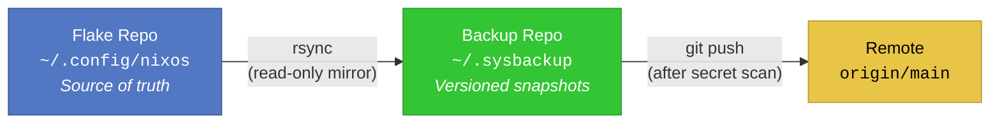
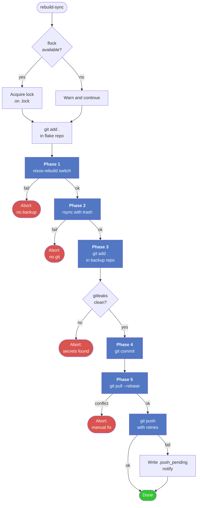

<div align="center">


# NixOS Configuration & Encrypted Backup Sync

**A reproducible NixOS flake, paired with a self-syncing, secret-scanned, off-machine dotfile backup.**

[](https://nixos.org)
[](https://nixos.wiki/wiki/Flakes)
[](https://hyprland.org)
[](https://fishshell.com)
[](#license)

</div>

---

## Table of Contents

1. [Overview](#overview)
2. [The Two-Repository Architecture](#the-two-repository-architecture)
3. [Repository Layout](#repository-layout)
4. [System Configuration](#system-configuration)
5. [The `rebuild-sync.fish` Script](#the-rebuild-syncfish-script)
6. [What Gets Backed Up](#what-gets-backed-up)
7. [First-Time Installation](#first-time-installation)
8. [Restoring on a New Machine](#restoring-on-a-new-machine)
9. [Day-to-Day Usage](#day-to-day-usage)
10. [Configuration Reference](#configuration-reference)
11. [Security Model](#security-model)
12. [Troubleshooting](#troubleshooting)
13. [FAQ](#faq)
14. [References](#references)

---

## Overview

This repository is the **single source of truth** for my NixOS workstation. It contains:

- A **NixOS flake** that declaratively describes the entire system: kernel, bootloader, desktop environment, services, users, and packages.
- A **rebuild-and-backup script** (`rebuild-sync.fish`) that turns any configuration change into a single, atomic, reproducible operation: rebuild the system, snapshot the dotfiles into a versioned backup repository, scan for secrets, and push off-machine.

The design goals are, in order:

| Priority | Goal | How it is achieved |
|---|---|---|
| 1 | **Reproducibility** | Everything is pinned via `flake.lock`. The system can be rebuilt from this repo on any x86-64 machine. |
| 2 | **Recoverability** | Rsync uses `--backup --backup-dir`, so every overwritten or deleted file is preserved in a timestamped trash directory before it disappears. |
| 3 | **Safety** | Gitleaks runs against the exact staged diff before any commit; the push is not performed if secrets are detected. |
| 4 | **Resilience** | Push retries with exponential backoff; failures are recorded in a `.push_pending` marker and retried on the next run. |
| 5 | **Automation without magic** | One command does everything. No daemons, no timers, no cron. |

This README assumes the reader is either the owner of the machine or someone restoring it. It documents not only *what* the config does, but *why* each design decision was made, so that future-me (or a stranger) can pick it up without reverse-engineering.

---

## The Two-Repository Architecture

The system is deliberately split into **two independent Git repositories**:

<div align="center">



</div>

### Flake Repo — `~/.config/nixos`

- **What it is:** the *live* configuration. Editing a file here and running `nixos-rebuild switch` changes the system immediately.
- **What it does *not* do:** it is not the backup. It is the *input* to the backup.
- **Why keep it separate?** The flake contains `flake.nix`, `configuration.nix`, `hardware-configuration.nix`. These are the *only* things needed to reproduce the OS. Everything else (dotfiles, scripts, `~/.local/bin`) lives elsewhere on the filesystem.

### Backup Repo — `~/.sysbackup`

- **What it is:** a Git repository that mirrors selected parts of your home directory plus the flake repo itself. It is committed and pushed by `rebuild-sync.fish`.
- **What it does *not* do:** it is not read from at runtime. Nothing in your system configuration references `~/.sysbackup`. It exists purely as an archive.
- **Why a separate repo?** Because it changes on a completely different cadence. You might edit `~/.config/hypr/hyprland.conf` a dozen times a day; you edit `configuration.nix` once a month. Mixing them means the flake's Git history becomes polluted with unrelated dotfile churn, and rolling back a `configuration.nix` change becomes impossible without also rolling back your dotfiles.

The backup repo also contains the `.gitignore`, `.lock`, `.push_pending`, and `.trash/` directory that govern its own operation — all of which are excluded from version control.

---

## Repository Layout

### The Flake Repo

```
~/.config/nixos/
├── flake.nix                    # Flake definition: inputs, outputs, host attr
├── flake.lock                   # Pinned input revisions (machine-generated)
├── configuration.nix            # Main system configuration
├── hardware-configuration.nix   # Auto-generated by nixos-generate-config
└── README.md                    # This file
```

### The Backup Repo

```
~/.sysbackup/                    # A Git repository
├── .git/                        # Backup history
├── .gitignore                   # Excludes runtime state
├── .lock                        # flock concurrency guard (gitignored)
├── .push_pending                # Present only when a push failed (gitignored)
├── .trash/                      # Per-run trash for overwritten/deleted files (gitignored)
│   └── YYYYMMDD-HHMMSS-XXXXXX/  # One directory per rsync run
├── backup.log                   # Append-only log of every run (tracked)
├── nixos/                       # Mirror of ~/.config/nixos (minus .git)
├── config/
│   ├── fish/                    # Fish shell configuration
│   ├── hypr/                    # Hyprland configuration
│   └── mpv/                     # MPV configuration and scripts
└── local/
    └── bin/                     # Personal scripts from ~/.local/bin
```

### The Runtime Script

`rebuild-sync.fish` is not stored in either repo by default. It lives wherever you keep your executables — typically `~/.local/bin/rebuild-sync.fish` — so that it is on `$PATH` and can be invoked as `rebuild-sync`. It is however *also* rsynced into the backup as part of `~/.local/bin/`, which means it is self-archiving.

---

## System Configuration

This section is a guided tour of `configuration.nix`. It explains the *intent* behind each block, not just the syntax.

### Host Identity

| Property | Value |
|---|---|
| Hostname | `nixos` |
| NetBIOS name | `nixos` |
| Flake attribute | `nixosConfigurations."nixos"` |
| Primary user | `shadrack` |
| Time zone | `Africa/Nairobi` |
| Locale | `en_US.UTF-8` |
| State version | `26.05` |

> **Note on state version:** `system.stateVersion = "26.05"` records the NixOS release whose defaults this system was *first* installed with. It is deliberately *not* updated when you upgrade. Changing it can silently alter stateful service behaviour (databases, `/var/lib` layouts). Leave it alone unless you know exactly why you are changing it.

The hostname is defined in `networking.hostName`, and the flake exposes exactly one configuration under the same name. The rebuild script reads `hostname` at runtime and targets that attribute — so the two must agree, or the rebuild will fail with `does not provide attribute 'nixosConfigurations.<host>'`. See [Troubleshooting](#troubleshooting) for the fix.

### Kernel

The system runs the **CachyOS kernel**, pinned via the `nix-cachyos-kernel` flake input with the `pinned` overlay. The overlay ensures the kernel is built against the *exact* nixpkgs revision declared in `flake.lock`, which is what guarantees binary cache hits from CachyOS's Lantian cache.

```nix
boot.kernelPackages = pkgs.cachyosKernels.linuxPackages-cachyos-latest-x86_64-v3;
```

The `-x86_64-v3` suffix means the kernel is compiled for CPUs supporting AVX2, BMI2, FMA, etc. (Intel Haswell / AMD Excavator or newer). If you restore this config on an older CPU, change this line or the kernel will refuse to boot.

### Bootloader

GRUB, in EFI mode, with the NixOS GRUB2 theme, installing to `nodev` (meaning: register with the firmware, do not reinstall the MBR). EFI variables are managed by NixOS (`canTouchEfiVariables = true`), and the ESP is mounted at `/boot`.

### Desktop Environment

The stack is **Hyprland** on **Wayland**, with **UWSM** (Universal Wayland Session Manager) providing session and service management, and **DMS shell** as the status bar / notification / launcher layer. XWayland is enabled for compatibility with games and a small number of legacy apps.

The greeter is `dms-greeter`, configured to launch the Hyprland compositor directly with `configHome = "/home/shadrack"` so that it reads the same config as an interactive login.

Portal configuration includes `xdg-desktop-portal-gtk` for file pickers; Hyprland provides its own `xdg-desktop-portal-hyprland` via the module.

### Graphics

Intel graphics are assumed. `hardware.graphics.enable` and `enable32Bit` are both on (required for Proton / DirectX translation in 32-bit games). The `extraPackages` list selects `intel-media-driver` (iHD) and `intel-vaapi-driver` (i965) with `libvdpau-va-gl` as a VDPAU shim. `LIBVA_DRIVER_NAME=iHD` is exported session-wide so VA-API consumers pick the modern driver.

### Services

| Service | Purpose |
|---|---|
| `tailscale` | Mesh VPN. Port `41641/UDP` is allowed. |
| `samba` | Read-only SMB shares for `~/Videos` and `~/Music`, auth required. |
| `waydroid` | Android container, using the `waydroid-nftables` variant. |
| `openssh` | Remote shell access. |
| `flatpak` | Flathub-compatible application sandbox. |
| `blueman` | Bluetooth tray UI. |
| `upower`, `acpid` | Power management. |
| `printing` | CUPS. |
| `udisks2`, `gvfs` | Removable media and virtual filesystem support. |

### Gaming

Steam with `remotePlay`, `dedicatedServer`, and `localNetworkGameTransfers` firewalls opened. `proton-ge-bin` is added as an `extraCompatPackage`, so Proton-GE appears in Steam's compatibility tool list without manual installation. `gamemode` is enabled system-wide.

### Firewall Summary

| Direction | Ports |
|---|---|
| TCP allowed | `8080`, `53317`, `1714–1764`, `30000–50000` |
| UDP allowed | `8080`, `41641`, `53317`, `1714–1764` |
| Trusted interfaces | `waydroid0`, `tailscale0` |

The `30000–50000/TCP` range is the standard Steam Remote Play range. `53317` is LocalSend. `41641/UDP` is Tailscale's direct-connection port.

---

## The `rebuild-sync.fish` Script

This is the heart of the workflow. It is a single Fish shell script that performs five phases in strict order. **No phase runs if the previous one failed.**

<div align="center">



</div>

### Phase 0 — Preconditions and Concurrency

Before anything else, the script:

1. **Refuses to run as root.** `sudo` is invoked internally; running the whole script as root would create root-owned files in your home directory.
2. **Creates `~/.sysbackup` and its subdirectories** if missing. Fails loudly if it cannot.
3. **Bootstraps `.gitignore`.** Ensures `.trash/`, `.push_pending`, and `.lock` are ignored, so runtime state never enters the backup history. This is idempotent — safe to run repeatedly.
4. **Acquires an exclusive lock** via `flock -n` on `~/.sysbackup/.lock`. If another instance is running, the script exits immediately. The lock is re-exec'd through the script itself (with a `NIXBUILD_LOCKED` sentinel to prevent infinite recursion), so the lock is held for the script's entire lifetime.

> **Why flock and not a PID file?** Because the kernel releases flock automatically when the process dies — even on `SIGKILL`. A PID file would leave a stale lock after a crash.

### Phase 1 — Rebuild

```fish
git -C $FLAKE_DIR add .
sudo nixos-rebuild switch --flake $FLAKE_DIR#$flake_host --log-format internal-json $argv |& nom --json
```

Two things happen here:

- **Staging the flake.** Flakes require all referenced files to be tracked by Git. If you add a new `.nix` file and don't `git add` it, `nixos-rebuild` will fail with `path '...' is not tracked`. The script stages everything automatically. It does *not* commit — that is left to your normal Git workflow.
- **Rebuilding.** The target is `$FLAKE_DIR#$flake_host`, where `flake_host` is `hostname`'s output unless `NIXBUILD_FLAKE_HOST` is set. Output is piped through `nom` (nix-output-monitor) for a live, tree-structured progress display, unless `nom` is not installed.

The exit code is captured from `nixos-rebuild`, not `nom` — this matters because Fish has no `pipefail`, so the pipeline's default `$status` would report the *last* command's result.

**On failure:** the script logs, notifies via `notify-send`, and exits `1`. **No backup is performed.** This is intentional: backing up after a failed rebuild would create a snapshot that does not correspond to a working system.

### Phase 2 — Rsync with Recoverable Deletes

The sync list is defined as source–destination pairs:

| Source | Destination |
|---|---|
| `~/.config/nixos/` | `~/.sysbackup/nixos/` |
| `~/.config/mpv/` | `~/.sysbackup/config/mpv/` |
| `~/.config/hypr/` | `~/.sysbackup/config/hypr/` |
| `~/.config/fish/` | `~/.sysbackup/config/fish/` |
| `~/.local/bin/` | `~/.sysbackup/local/bin/` |

The rsync invocation is:

```fish
rsync -a --delete-after --stats --backup --backup-dir=$run_trash \
      --exclude=.git --exclude=.direnv/ --exclude=result \
      $src $dst
```

Each flag has a specific purpose:

| Flag | Purpose |
|---|---|
| `-a` | Archive mode: preserve permissions, timestamps, symlinks, ownership. |
| `--delete-after` | Remove files in the destination that are not in the source — but only *after* the transfer completes, so an interrupted run leaves the destination consistent. |
| `--backup` | Before overwriting or deleting a destination file, save a copy. |
| `--backup-dir=$run_trash` | Put those copies in a **per-run timestamped directory** under `~/.sysbackup/.trash/`. This is what makes deletes recoverable. |
| `--exclude=.git` | Do not rsync nested Git repositories. Without this, `~/.config/nixos/.git` would be copied into the backup, creating a gitlink that breaks `git add .`. |
| `--exclude=.direnv/`, `--exclude=result` | Build artifacts and Nix store symlinks. Not useful in a backup. |

After all syncs, if the trash directory is empty (nothing was overwritten or deleted this run), it is removed. Otherwise it is left in place and grows the backup's on-disk footprint by exactly the size of the deleted/overwritten files.

**Recovery:** to restore a file that was deleted by a run on `2026-09-20` at `14:30:22`, look in `~/.sysbackup/.trash/20260920-143022-XXXXXX/` and find the file at its original relative path.

### Phase 3 — Secret Scan

```fish
git -C $BACKUP_DIR add .
gitleaks git $BACKUP_DIR --staged --no-banner --redact --exit-code 1
```

Gitleaks runs against the **staged diff** — exactly what the next commit would contain. This is the last line of defence against accidentally versioning an API key, token, or password that found its way into `~/.config/`.

Exit codes are interpreted distinctly:

| Code | Meaning | Action |
|---|---|---|
| `0` | No secrets found | Continue. |
| `1` | Secrets found | Abort, notify, exit `1`. |
| Other | gitleaks itself errored (e.g. unsupported flag) | Abort *fail-closed*. Do not commit. |

Fail-closed on tool errors is deliberate: a broken scanner that silently allows commits is worse than no scanner at all.

If `gitleaks` is not installed, a warning is logged and the scan is skipped — the script does not fail. This is a trade-off; install gitleaks if you want the guarantee.

### Phase 4 — Commit

If `git status --porcelain` reports any staged changes, the script commits them with a structured message:

```
backup: post-rebuild sync 2026-09-20 14:30:22
Host: nixos
NixOS: 26.05.20260915.abcdef
Files changed: 42
```

If there are no changes, the commit is skipped and a message is logged. The script does *not* abort — pushing a no-op commit would be noise.

### Phase 5 — Rebase and Push

```fish
git pull --rebase --autostash origin main
git push origin main
```

The pull-rebase is attempted only if the remote branch exists (`git ls-remote --exit-code`). This makes the script safe to run on a brand-new backup repo that has no remote yet — it will simply skip the pull and push the initial commit.

The push is retried up to **3 times** with exponential backoff (`2s`, `4s`, `8s`). If all retries fail:

- `~/.sysbackup/.push_pending` is created (empty file).
- A `notify-send` notification is fired.
- The script exits `0` — *not* an error — because the commit is safely stored locally.

On the next run, if `.push_pending` exists, the script will still push normally — the marker is only used to decide whether to log the "cleared pending push" message and delete the file on success.

### Logging

Every run appends to `~/.sysbackup/backup.log`, which is itself tracked by Git (so you get history of the log). Log levels:

| Level | stdout | Log file | Colour |
|---|---|---|---|
| `STEP` | yes | yes | cyan |
| `OK` | yes | yes | green |
| `WARN` | yes | yes | yellow |
| `ERROR` | yes | yes | red |
| `INFO` | no | yes | — |

Colours are suppressed when stdout is not a TTY (e.g. when run from a cron job or piped to a file).

### Notifications

`notify-send` is invoked on rebuild failure, sync failure, secret detection, rebase conflict, and push failure. It is skipped automatically when `$DISPLAY` and `$WAYLAND_DISPLAY` are both unset — i.e. over SSH or in a headless session.

---

## What Gets Backed Up

The backup contains **exactly** these paths, and nothing else:

| Path in backup | Source | Contains |
|---|---|---|
| `nixos/` | `~/.config/nixos/` | The entire flake (minus `.git`) |
| `config/mpv/` | `~/.config/mpv/` | MPV config and downloaded scripts |
| `config/hypr/` | `~/.config/hypr/` | Hyprland config, monitors, keybinds |
| `config/fish/` | `~/.config/fish/` | Fish config, functions, completions |
| `local/bin/` | `~/.local/bin/` | Personal executable scripts (including `rebuild-sync.fish` itself) |
| `backup.log` | — | Append-only run log |
| `.gitignore` | — | Backup repo's own ignore file |

It does **not** contain:

- `~/.ssh/`, `~/.gnupg/`, `~/.config/sops/` — private keys and secrets are intentionally excluded.
- `~/.cache/`, `~/.local/share/`, `~/.local/state/` — regenerable state.
- The Nix store itself — that is Nix's job, via the flake and its lock file.
- `~/.config/nixos/.git` — the flake's Git history stays with the flake.

> **If you want to add a path to the backup**, edit the `syncs` list in `rebuild-sync.fish`. See [Configuration Reference](#configuration-reference).

---

## First-Time Installation

This section assumes you are on a fresh NixOS install with a working `nixos-rebuild` and a functioning network.

### 1. Clone the flake

```fish
git clone <your-remote> ~/.config/nixos
cd ~/.config/nixos
```

If you already have `~/.config/nixos/` from the installer, move it aside first.

### 2. Verify the flake evaluates

```fish
nix flake check
nix eval .#nixosConfigurations --apply builtins.attrNames
```

The second command should print `[ "nixos" ]`. If it prints anything else, either the flake defines a different hostname or you are on a different machine — see [Troubleshooting](#troubleshooting).

### 3. Build once, manually

```fish
sudo nixos-rebuild switch --flake ~/.config/nixos#nixos
```

This is the one time you should bypass `rebuild-sync.fish` — because the script asks `hostname` for the flake attribute, and on a fresh install the running hostname may not yet be `nixos`. Once this command succeeds and you reboot, `hostname` will match.

### 4. Install the script

```fish
mkdir -p ~/.local/bin
cp /path/to/rebuild-sync.fish ~/.local/bin/
chmod +x ~/.local/bin/rebuild-sync.fish
```

Ensure `~/.local/bin` is on `$PATH` (it is by default in NixOS for interactive shells if the directory exists).

### 5. Initialize the backup repo

```fish
mkdir -p ~/.sysbackup
cd ~/.sysbackup
git init
git remote add origin <your-backup-remote>
git branch -M main
```

### 6. Dry-run the rsync

Before trusting the script, verify that the `--delete-after` on `~/.config/nixos/` won't remove anything you care about. Add `--dry-run` to `rsync_opts` temporarily:

```fish
set -l rsync_opts -a --delete-after --stats --backup --backup-dir=$run_trash \
                  --exclude=.git --exclude=.direnv/ --exclude=result \
                  --dry-run
```

Run once, inspect the output, then remove `--dry-run`.

### 7. Run it for real

```fish
rebuild-sync.fish
```

The first run will commit and push the initial snapshot. Expect a large initial commit.

### 8. Confirm the remote

```fish
git -C ~/.sysbackup log --oneline -5
git -C ~/.sysbackup status
```

---

## Restoring on a New Machine

This is the section to read when your old machine is gone and you are staring at a fresh NixOS USB installer.

### Phase A — Bootstrap the OS

1. **Install NixOS.** A minimal install is sufficient. You do not need the graphical installer; the config here provides everything.
2. **Set the hostname to `nixos`** during installation, or plan to pass `--flake ...#nixos` explicitly.
3. **Ensure network access.** `curl` and `git` are available in the installer environment.

### Phase B — Clone and Build

```fish
git clone <your-remote> ~/.config/nixos
sudo nixos-rebuild switch --flake ~/.config/nixos#nixos
```

If the hardware is different (different GPU, different disk layout), the flake will build but `hardware-configuration.nix` will not match. You will need to regenerate it:

```fish
sudo nixos-generate-config --show-hardware-config > /tmp/hw.nix
# Compare with ~/.config/nixos/hardware-configuration.nix
# Merge in the disk/filesystem sections manually.
```

Do not blindly overwrite the existing file — the installer's version may reference devices that no longer exist, and the flake's version may have customisations (e.g. extra mounts) that the installer will not regenerate.

### Phase C — Restore the Backup Repo

```fish
git clone <your-backup-remote> ~/.sysbackup
```

If the remote is private and you are using SSH keys, generate a new key on the new machine, add it to the remote, and clone. If the remote is gone but you have a local copy on a USB drive:

```fish
cp -a /run/media/usb/sysbackup ~/.sysbackup
```

### Phase D — Rehydrate Dotfiles

The backup stores files at their *original* relative paths, so restoration is a targeted copy. **Do not** copy the entire backup into your home directory — it contains `nixos/`, `backup.log`, and `.git/`, which you do not want as top-level entries.

Restore each path manually:

```fish
mkdir -p ~/.config
cp -a ~/.sysbackup/config/mpv    ~/.config/
cp -a ~/.sysbackup/config/hypr   ~/.config/
cp -a ~/.sysbackup/config/fish   ~/.config/

mkdir -p ~/.local
cp -a ~/.sysbackup/local/bin     ~/.local/
```

The flake itself is already in place from Phase B — do **not** copy `~/.sysbackup/nixos/` over it, because the backup copy has no `.git/` and you would lose history.

### Phase E — Reattach the Script

```fish
chmod +x ~/.local/bin/rebuild-sync.fish
```

Confirm `~/.local/bin/rebuild-sync.fish` is on `$PATH`:

```fish
type -a rebuild-sync
```

### Phase F — Fix the Remote

If the backup remote's URL changed, update it:

```fish
git -C ~/.sysbackup remote set-url origin <new-url>
```

### Phase G — First Run

```fish
rebuild-sync.fish
```

Expect it to find no changes (the freshly cloned backup matches your restored dotfiles) and either skip the commit or create an empty one depending on Git's configuration. The push will confirm connectivity.

### Phase H — Restore Anything Not in the Backup

The backup deliberately omits secrets. After restore, you will need to:

- Regenerate `~/.ssh/id_*` and add the public keys to your remotes and servers.
- Restore any GPG keys from an offline backup.
- Re-login to Tailscale (`sudo tailscale up`).
- Re-authenticate Steam, Firefox, and any Flatpak apps.
- Restore Samba user passwords: `sudo smbpasswd -a shadrack`.

---

## Day-to-Day Usage

### The normal workflow

1. Edit a file — either in the flake (`~/.config/nixos/`) or in a dotfile path.
2. If you changed a `.nix` file, `git add` it in the flake repo.
3. Run `rebuild-sync.fish`.
4. Watch the output. Green means success.

That is the whole workflow. There is no separate "backup" step and no separate "commit" step.

### Recovering a deleted file

```fish
ls -1 ~/.sysbackup/.trash/ | tail -5
# Pick a timestamp, then:
find ~/.sysbackup/.trash/20260920-143022-XXXXXX -type f
```

Copy the file out and place it where it belongs. The relative path inside the trash directory mirrors the path inside the backup's destination — so `~/.sysbackup/.trash/<ts>/config/hypr/hyprland.conf` corresponds to `~/.sysbackup/config/hypr/hyprland.conf`.

### Rolling back a dotfile change

Since the backup is a Git repo, you can simply:

```fish
git -C ~/.sysbackup log --oneline -- config/hypr/hyprland.conf
git -C ~/.sysbackup show <commit>:config/hypr/hyprland.conf > /tmp/old
# Copy /tmp/old to ~/.config/hypr/hyprland.conf
```

Or, for a full-file restore:

```fish
git -C ~/.sysbackup checkout <commit> -- config/hypr/hyprland.conf
cp ~/.sysbackup/config/hypr/hyprland.conf ~/.config/hypr/hyprland.conf
```

### Rolling back a system change

```fish
git -C ~/.config/nixos log --oneline
git -C ~/.config/nixos revert <bad-commit>
sudo nixos-rebuild switch --flake ~/.config/nixos#nixos
```

Or use NixOS's built-in generation rollback:

```fish
sudo nixos-rebuild switch --rollback
```

This switches to the previous generation without touching Git — useful when the broken change is not yet committed.

### Cleaning old trash

`~/.sysbackup/.trash/` grows unbounded. Prune it periodically:

```fish
find ~/.sysbackup/.trash -maxdepth 1 -type d -mtime +30 -exec rm -rf {} +
```

This removes trash directories older than 30 days. Adjust to taste. The trash is gitignored, so this does not affect history — but it does mean you lose recoverability for those older runs.

### Amending the sync list

Edit the `syncs` list in `rebuild-sync.fish`:

```fish
set -l syncs \
    $FLAKE_DIR/                           $BACKUP_DIR/nixos/ \
    $HOME/.config/mpv/                    $BACKUP_DIR/config/mpv/ \
    $HOME/.config/hypr/                   $BACKUP_DIR/config/hypr/ \
    $HOME/.config/fish/                   $BACKUP_DIR/config/fish/ \
    $HOME/.local/bin/                     $BACKUP_DIR/local/bin/
```

The list is flat pairs of source–destination. The script validates that the list has an even number of entries before proceeding.

---

## Configuration Reference

### Environment variables

| Variable | Effect |
|---|---|
| `NIXBUILD_FLAKE_HOST` | Overrides the flake attribute used for `nixos-rebuild`. Set this if `hostname` does not match the attr name. |
| `NIXBUILD_LOCKED` | Set internally by the script when re-exec'ing under flock. Do not set manually. |

### Script constants

All defined at the top of `rebuild-sync.fish`:

| Constant | Default | Meaning |
|---|---|---|
| `BACKUP_DIR` | `$HOME/.sysbackup` | Root of the backup repo. |
| `LOG_FILE` | `$BACKUP_DIR/backup.log` | Append-only log. |
| `TRASH_DIR` | `$BACKUP_DIR/.trash` | Parent of per-run trash directories. |
| `PENDING_FILE` | `$BACKUP_DIR/.push_pending` | Marker written when a push fails. |
| `LOCK_FILE` | `$BACKUP_DIR/.lock` | flock target. |
| `REMOTE` | `origin` | Git remote name. |
| `BRANCH` | `main` | Branch to pull, rebase onto, and push. |
| `PUSH_RETRIES` | `3` | Number of push attempts before giving up. |
| `FLAKE_DIR` | `$HOME/.config/nixos` | The flake repo. |

### Flake inputs

| Input | URL | Purpose |
|---|---|---|
| `nixpkgs` | `github:nixos/nixpkgs/nixos-unstable` | Base package set. |
| `nix-cachyos-kernel` | `github:xddxdd/nix-cachyos-kernel/release` | CachyOS kernel + pinned overlay. |

To update all inputs:

```fish
cd ~/.config/nixos
nix flake update
sudo nixos-rebuild switch --flake .#nixos
```

To update a single input:

```fish
nix flake lock --update-input nix-cachyos-kernel
```

---

## Security Model

The threat model is: *I have a private Git remote, and I do not want secrets to reach it.*

| Control | What it protects against |
|---|---|
| `gitleaks git --staged` | API keys, tokens, passwords accidentally written to a tracked file. |
| `--exclude=.git` in rsync | Nested Git repos being versioned as gitlinks. |
| `.gitignore` bootstrap | Runtime state (`.lock`, `.push_pending`, `.trash/`) leaking into history. |
| Explicit sync list | Arbitrary home directory contents being captured. The list is short and auditable. |
| No secrets in the flake | `configuration.nix` contains no passwords or keys. |
| `flock -n` | Two concurrent runs interleaving writes to the backup. |

**What is *not* protected:**

- The remote. If the remote is compromised, the attacker has everything in the backup. Do not back up secrets unless the remote is trusted.
- The local backup repo. It is a plain Git directory on disk. Full-disk encryption is assumed.
- The log file. `backup.log` is tracked, so anything the script logs goes to the remote. The script does not log file contents — only paths and status messages.

If you want to back up secrets, use `sops-nix` or `agenix` and commit *encrypted* files. The `gitleaks` scan will not flag them because they are ciphertext.

---

## Troubleshooting

### `flake '...' does not provide attribute 'nixosConfigurations.<host>'`

The running `hostname` does not match the flake attribute. Verify:

```fish
hostname
nix eval ~/.config/nixos#nixosConfigurations --apply builtins.attrNames
```

If `hostname` prints something other than `nixos`, either:

- Run with an explicit target: `sudo nixos-rebuild switch --flake ~/.config/nixos#nixos`
- Or export `NIXBUILD_FLAKE_HOST=nixos` before running `rebuild-sync.fish`.

Once the rebuild succeeds with `networking.hostName = "nixos"`, the running hostname will match and the override becomes unnecessary.

### `error: path '...' is not tracked by Git`

A file referenced by the flake is not `git add`-ed. The script does this automatically, but if it fails (e.g. not a Git repo), stage manually:

```fish
git -C ~/.config/nixos add .
```

### `nixos-rebuild: command not found` under `sudo`

`sudo` does not inherit your `PATH` by default. Either use the absolute path:

```fish
sudo /run/current-system/sw/bin/nixos-rebuild switch --flake ~/.config/nixos#nixos
```

Or add `nixos-rebuild` to `security.sudo.extraConfig`'s `secure_path`. The script itself does not do this — it calls `sudo nixos-rebuild` and relies on the standard NixOS `sudo` configuration, which works because NixOS installs `nixos-rebuild` into the system profile.

### `gitleaks` reports a false positive

Add an allowlist entry to `.gitleaks.toml` in the backup repo:

```toml
[allowlist]
description = "False positives"
regexes = [
    '''EXAMPLE_KEY_[A-Z0-9]+''',
]
paths = [
    '''backup\.log$''',
]
```

Then re-run.

### `gitleaks` errors with `unknown flag: --staged`

Your gitleaks version predates the `git` subcommand's `--staged` flag. Either upgrade:

```fish
nix profile install nixpkgs#gitleaks
```

Or, if you must stay on an older version, change the invocation in the script to:

```fish
gitleaks protect --staged --no-banner --redact --exit-code 1 --source $BACKUP_DIR
```

### Push keeps failing

Check connectivity:

```fish
git -C ~/.sysbackup ls-remote origin
```

If it hangs, the remote is unreachable. The script will leave a `.push_pending` marker; resolve the network issue and re-run.

If authentication is failing, verify your SSH key:

```fish
ssh -T git@github.com   # or whatever your remote is
```

### Rebase conflict

The script aborts the rebase automatically and exits. Resolve manually:

```fish
cd ~/.sysbackup
git status
# Fix conflicts in the listed files
git add <fixed-files>
git rebase --continue
git push origin main
```

The next `rebuild-sync.fish` run will then proceed normally.

### The `.lock` file is stuck

It shouldn't be — flock releases on process exit. If you *know* no other instance is running and the script still refuses to start:

```fish
fuser ~/.sysbackup/.lock
```

If the output is empty, the file is not actually locked; the script should proceed. If it names a process, that process holds the lock.

### `rsync` reports `code 24`

`rsync` exit code 24 means "some source files vanished during transfer" — usually a cache or temp file. The script treats this as a warning, not an error. It is safe to ignore.

### A file I deleted from `~/.config/` still shows up in the backup

`--delete-after` deletes it from the destination on the *next* run, not immediately. Run `rebuild-sync.fish` once more.

### The backup log is enormous

Prune it:

```fish
tail -n 5000 ~/.sysbackup/backup.log > /tmp/log
mv /tmp/log ~/.sysbackup/backup.log
git -C ~/.sysbackup add backup.log
git -C ~/.sysbackup commit -m "chore: prune backup.log"
```

---

## FAQ

**Why not use Home Manager?**

Home Manager is a fine choice, but it introduces a second configuration layer (user-level) that must stay in sync with the system layer. This configuration deliberately keeps everything at the system level, using plain files for dotfiles and NixOS modules for everything else. If you later want Home Manager, it slots in as a flake input without disturbing the existing structure.

**Why not `sops-nix` or `agenix` for secrets?**

Because the backup deliberately contains no secrets. If you add a secret to the flake (e.g. a WiFi password), wrap it in sops-nix and commit the ciphertext. The `gitleaks` scan will pass because the file is encrypted.

**Why does the script commit the flake's stage but not commit the flake itself?**

Staging is required for `nixos-rebuild` to see new files. Committing is your decision — you might be mid-edit and not ready. The backup captures the flake's *working tree*, not its Git state.

**Can I run this from a systemd timer?**

Yes. Create a user timer:

```nix
systemd.user.services.rebuild-sync = {
  description = "NixOS rebuild + backup sync";
  serviceConfig.Type = "oneshot";
  serviceConfig.ExecStart = "%h/.local/bin/rebuild-sync.fish";
};

systemd.user.timers.rebuild-sync = {
  wantedBy = [ "timers.target" ];
  timerConfig.OnCalendar = "daily";
  timerConfig.Persistent = true;
};
```

Note: `notify-send` will silently no-op in this context because there is no session bus, which is correct behaviour.

**Can I run it manually without rebuilding?**

Not with the current script — the rebuild is unconditional. If you want a backup-only mode, add an environment check:

```fish
if not set -q NIXBUILD_SKIP_REBUILD
    # rebuild block
end
```

Then `set -x NIXBUILD_SKIP_REBUILD 1; rebuild-sync.fish` skips the rebuild.

**What happens if the machine dies mid-run?**

Flock is released automatically. The backup repo will have partial state — files may have been copied but not committed. The next run will re-rsync and pick up where it left off. No data is lost because `--delete-after` only runs after successful transfer, and `--backup` preserves overwritten files.

**What if I want to back up a path that does not exist yet?**

The script skips missing sources with a `WARN` and continues. Add the path to the `syncs` list; it will start being backed up as soon as it exists.

**How do I add a second machine?**

Duplicate the flake, change `nixosConfigurations."<host>"` and `networking.hostName` to match the new machine, and add a second entry to the `syncs` list in the script (or use separate backup repos per machine). The current script assumes one host.

---

## References

- [NixOS Manual](https://nixos.org/manual/nixos/stable/)
- [Nix Flakes](https://nixos.wiki/wiki/Flakes)
- [Hyprland Wiki](https://wiki.hyprland.org/)
- [CachyOS Kernel for Nix](https://github.com/xddxdd/nix-cachyos-kernel)
- [gitleaks](https://github.com/gitleaks/gitleaks)
- [rsync manual](https://download.samba.org/pub/rsync/rsync.1)
- [Fish shell documentation](https://fishshell.com/docs/current/)
- [UWSM](https://github.com/Vladimir-csp/uwsm)
- [nix-output-monitor](https://github.com/maralorn/nix-output-monitor)

---

<div align="center">

**Maintained by** `shadrack`
**Hostname** `nixos`
**Last reviewed** 2026-09-20

<sub>This README is part of the flake repo and is itself rsynced into the backup, so it survives any restore.</sub>

</div>
